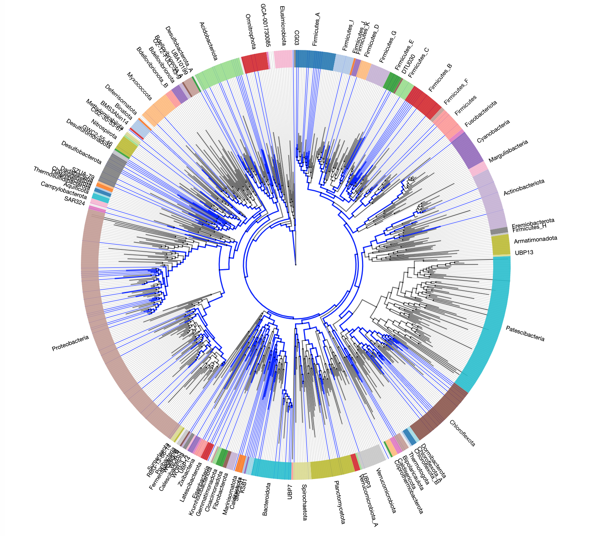

Sept 26, 2019
---
* AnnoTree now supports the addition of "Taxonomic Labels" to the outer edge of the tree. e.g., By default, all order level taxonomies are labeled according to phylum. Set 'Taxonomic level' to 'none' if you want the original view.

Aug 26, 2019
----
* AnnoTree has been updated to GTDB version 89.0, please clear browser cache (shift + click the refresh button) and refresh.
* The new 89.0 version uses 1 genome per every species, instead of possibily more than 1 in previous versions. As a result, "genome" level is removed.

Aug 23, 2020
----
* AnnoTree has been updated to GTDB version 95, please clear browser cache (shift + click the refresh button) and refresh.
* GTDB release notes can be found at https://data.ace.uq.edu.au/public/gtdb/data/releases/release95/95.0/RELEASE_NOTES
