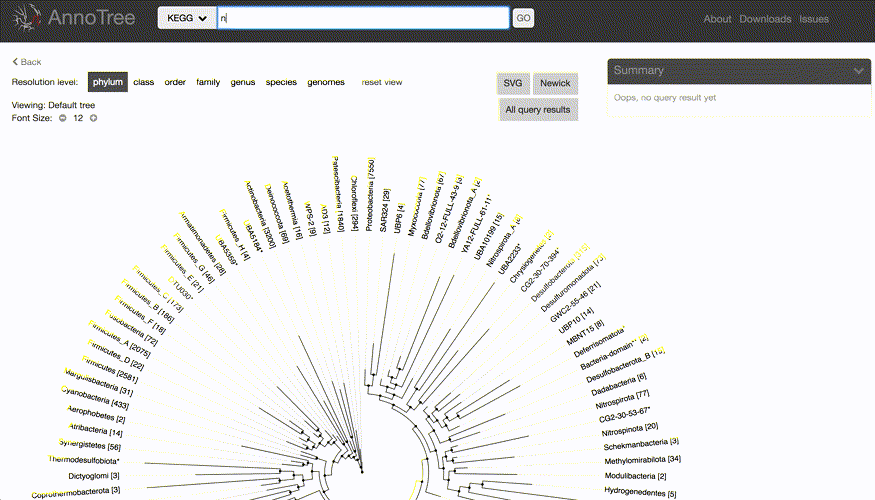
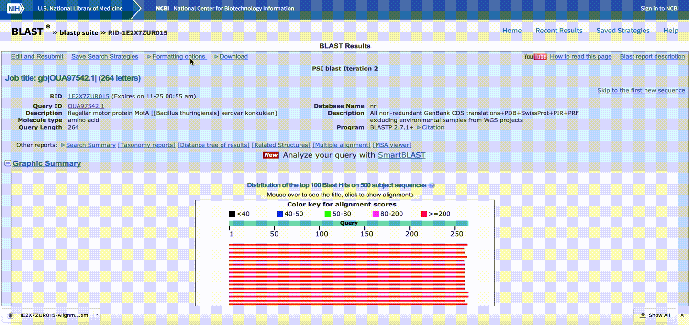

Example Queries
----

**Searching genomes including KEGG term nitrite reductase, and assimilatory nitrate reductase**

 

**Searching taxa clostridium genus and a specific clostridium genome**

 

**Searching genomes containing flagellin basal body domain and flagellin D3 domain**

 

**Uploading BLAST Result for Taxonomy Search**

1. Format XML output to have some E value cut off [filter out insignificant hits]
2. download XML2 in a single file
3. Upload that file to app under taxonomy section
4. Note that, only species id in BLAST file is considered
 

 

